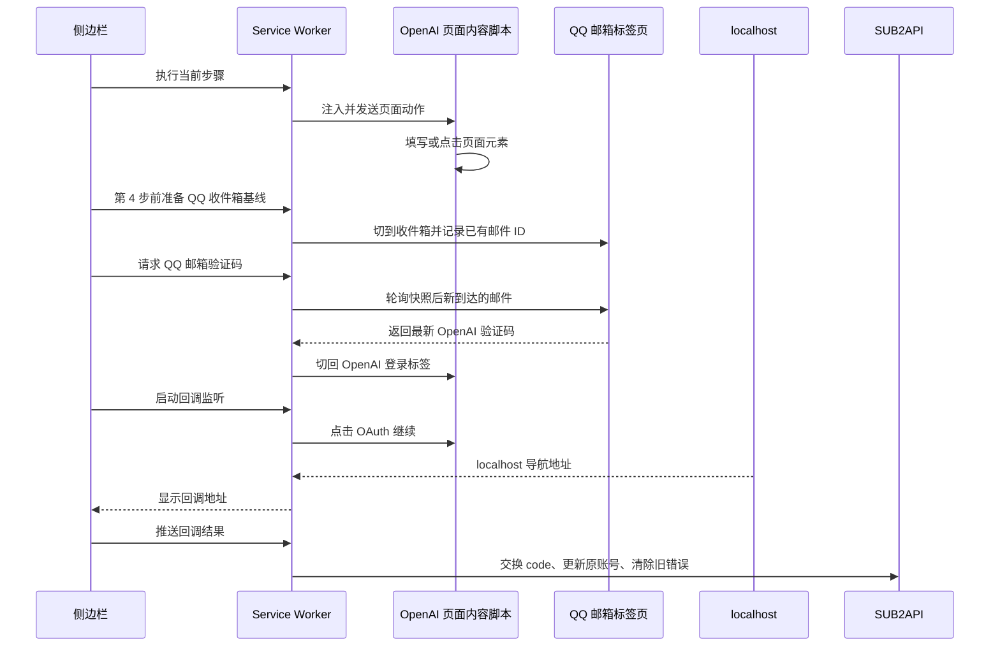

# FlowPilot 登录流程对照

本项目只抽取你要学习的“正常路径”。原项目需要兼容多种邮箱服务商、页面重试、手机号登录、Cloudflare 验证和调试器点击，因此代码体量会大很多；这些恢复分支没有整体复制进来。

FlowPilot 的界面编号与这里的第 0 到 10 步并不完全相同：登录通常是原项目的 Step 7，登录邮件验证码是 Step 8，OAuth 同意和回调捕获是 Step 9。

## 第 0 到 10 步函数表

| 你的步骤 | FlowPilot 原函数 | 教学版函数 | 作用与差异 |
| --- | --- | --- | --- |
| 0. 打开重授权页 | `prepareFirstOpenAiAccountReauth` | `prepareReauthForAccount`、`OPEN_FIRST_OPENAI_REAUTH` | 直接使用上方查询结果的第一个候选账号，传递 `account_id`、`proxy_id` 和 localhost 回调地址给 SUB2API，再在新标签页打开返回的 `auth_url`。不更新账号。 |
| 1. 填写邮箱 | `getLoginEmailInput`、`step6LoginFromEmailPage` | `getLoginEmailInput`、`step6LoginFromEmailPage` | 找到邮箱框，用原生 value setter 和 `input`/`change` 事件写入值。原版随后会自动提交；教学版停在这里。 |
| 2. 点击继续 | `getLoginSubmitButton`、`triggerLoginSubmitAction` | `getLoginSubmitButton`、`clickLoginContinue` | 找当前可用的 submit/Continue 按钮并点击，方便你先看到密码页。 |
| 3. 填写密码 | `getLoginPasswordInput`、`step6LoginFromPasswordPage` | `getLoginPasswordInput`、`step6LoginFromPasswordPage` | 找到 `input[type=password]` 后填写。为满足本项目的学习需求，OpenAI 密码会写入本机 `chrome.storage.local`，关闭侧边栏后仍可恢复。 |
| 4. 点击继续 | `triggerLoginSubmitAction` | `captureQqMailBaseline`、`clickLoginContinue` | 先切到 QQ 收件箱；若当前停在邮件详情页，会点击新版 QQ 的收件箱侧栏入口，等待列表加载并记录已有邮件 ID，再切回 OpenAI 提交密码。 |
| 5. 从 QQ 邮箱取得验证码 | `content/qq-mail.js` 的 `handlePollEmail`、`pollFreshVerificationCode` | `fetchQqOpenAiLoginCode`、`startQqMailCodeJob`、`performQqMailCodeJobCheck` | 侧边栏创建任务，后台用短检查和 alarm 恢复任务；只接受第 4 步快照之后新到达的 OpenAI/ChatGPT 邮件，不回退到旧邮件。打开候选邮件后还会确认详情或选中行的邮件 ID 一致，才读取正文验证码；成功后自动切回 OpenAI 标签。扩展不保存 QQ 密码或登录态。 |
| 6. 填写验证码 | `getVerificationCodeTarget`、`fillVerificationCode` | `getVerificationCodeTarget`、`fillVerificationCode` | 兼容完整验证码框和多个单字符输入框。 |
| 7. 点击继续 | `submitVerificationCode` | `clickVerificationContinue` | 原版后台把验证码发送给内容脚本并检查结果；教学版把点击拆出来，以便观察页面切换。 |
| 8. OAuth 授权继续 | `getOAuthConsentForm`、`getPrimaryContinueButton`、`isOAuthConsentPage`、`step8_findAndClick`、`step8_triggerContinue` | 同名函数 | 先定位授权页，再用表单 `requestSubmit` 或原生 click 确认。侧边栏会先启动第 9 步监听。 |
| 9. 取得回调 | `createStep9Executor`、`executeStep9`、`finalizeStep9Callback` | `captureLocalhostCallback`、`isLocalhostCallbackUrl` | 原版监听 `webNavigation` 和标签更新，再把地址交给流程节点。教学版只保留 `http(s)://localhost/...` 过滤并显示地址。 |
| 10. 推送到 SUB2API | `submitOpenAiAccountReauthCallback` | `submitReauthCallback`、`SUBMIT_OPENAI_REAUTH_CALLBACK` | 校验回调的 `state` 与第 0 步一致，以 `session_id`、`code`、`state` 交换新令牌，再只更新第 0 步选择的原账号，最后尽力清除旧错误状态。 |

## 原项目位置

| 功能 | FlowPilot 文件 |
| --- | --- |
| 登录页面 DOM、验证码框、OAuth 同意页 | `../../FlowPilot/flows/openai/content/openai-auth.js` |
| 登录验证码的邮箱轮询与提交 | `../../FlowPilot/background/verification-flow.js` |
| QQ 邮箱页面取码 | `../../FlowPilot/content/qq-mail.js` |
| Step 8 的邮箱验证码编排 | `../../FlowPilot/flows/openai/background/steps/fetch-login-code.js` |
| OAuth 同意点击和 localhost 回调监听 | `../../FlowPilot/flows/openai/background/steps/confirm-oauth.js` |

## 新项目的调用路径

1. [sidepanel/sidepanel.js](../sidepanel/sidepanel.js) 先查询分组。第 0 步发送 `OPEN_FIRST_OPENAI_REAUTH`，并把首个候选账号和当前 SUB2API 连接信息交给后台。
2. [background/background.js](../background/background.js) 调用 [background/sub2api-client.js](../background/sub2api-client.js) 的 `prepareReauthForAccount`，再用 `chrome.tabs.create` 打开返回的授权页。
3. 第 4 步先按需请求 QQ 邮箱站点权限；后台找到 QQ 标签并注入 [content/qq-mail-learning.js](../content/qq-mail-learning.js)，从详情页回到收件箱后保存旧邮件 ID 快照，再恢复 OpenAI 标签并提交密码。其他页面步骤按需请求 OpenAI 和 localhost 的可选站点权限，并通过 `RUN_OPENAI_LEARNING_STEP` 注入 [content/openai-login-learning.js](../content/openai-login-learning.js)。
4. 第 5 步由 `fetchQqOpenAiLoginCode` 创建一个带 `jobId` 的验证码任务。`background.js` 的 `performQqMailCodeJobCheck` 每次只做一次短检查，侧边栏通过 `GET_QQ_OPENAI_LOGIN_CODE_STATUS` 读取进度，alarm 可以在 service worker 休眠后恢复检查。任务完成时，后台在同一次受保护的状态迁移中保存验证码并标记完成；旧任务即使迟到返回，也不能覆盖新任务的状态或验证码。
5. 内容脚本的 `checkQqOpenAiLoginCode` 只扫描第 4 步快照后新增的 OpenAI/ChatGPT 邮件。若列表摘要没有验证码，会先记录候选邮件 ID；下一次检查必须确认详情区域或列表选中项仍属于该邮件，才从正文提取验证码。这样手动点开一封旧邮件不会被当成新验证码。
6. 点击第 8 步前，service worker 把“正在监听”写入 `chrome.storage.session`；`webNavigation.onBeforeNavigate` 和 `onCommitted` 遇到 localhost 地址后写入结果。
7. 第 10 步把第 0 步暂存在 `chrome.storage.session` 的账号、`session_id` 和 OAuth `state` 与第 9 步回调组合，调用 SUB2API 交换并更新凭据。

## 完整演示

[sidepanel/sidepanel.js](../sidepanel/sidepanel.js) 的 `runFullDemo` 按同一组第 0 到第 10 步函数依次调用，不另行复制页面自动化逻辑。它会在开始时一次性请求所需站点访问权限，并通过第 0 步保存的 OpenAI 标签 ID 继续执行，避免 QQ 邮箱切换标签后误操作。第 5 步没有本次验证码或第 9 步没有回调时会停止，不执行后续推送。

## 第 5 步为什么会切换标签

QQ 邮箱的登录态由 Chrome 自己保存。扩展不能也不需要知道 QQ 密码：第 4 步会短暂切到已登录的邮箱标签，确保收件箱列表已打开并记录旧邮件；第 5 步在该标签页中只读取之后新出现的 OpenAI/ChatGPT 验证码，取到后自动切回第 0 到 4 步打开的 OpenAI 标签。取正文前会再次确认当前详情就是候选新邮件，因此不会因为你手动浏览旧邮件而填入旧验证码。

如果没有已登录的 QQ 邮箱标签，扩展会先打开 `https://wx.mail.qq.com/` 并停在 QQ 登录页。你完成 QQ 登录后，再回到侧边栏点击第 5 步即可。QQ 密码不会写进 side panel、`chrome.storage.local` 或 Git。
