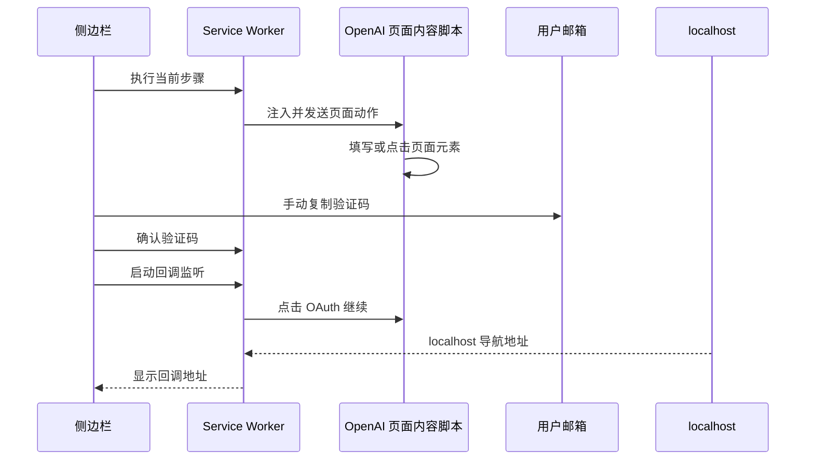

# FlowPilot 登录流程对照

本项目只抽取你要学习的“正常路径”。原项目需要兼容多种邮箱服务商、页面重试、手机号登录、Cloudflare 验证和调试器点击，因此代码体量会大很多；这些恢复分支没有整体复制进来。

FlowPilot 的界面编号与这里的第 0 到 9 步并不完全相同：登录通常是原项目的 Step 7，登录邮件验证码是 Step 8，OAuth 同意和回调捕获是 Step 9。

## 第 0 到 9 步函数表

| 你的步骤 | FlowPilot 原函数 | 教学版函数 | 作用与差异 |
| --- | --- | --- | --- |
| 0. 打开重授权页 | `prepareFirstOpenAiAccountReauth` | `prepareReauthForAccount`、`OPEN_FIRST_OPENAI_REAUTH` | 直接使用上方查询结果的第一个候选账号，传递 `account_id`、`proxy_id` 和 localhost 回调地址给 SUB2API，再在新标签页打开返回的 `auth_url`。不更新账号。 |
| 1. 填写邮箱 | `getLoginEmailInput`、`step6LoginFromEmailPage` | `getLoginEmailInput`、`step6LoginFromEmailPage` | 找到邮箱框，用原生 value setter 和 `input`/`change` 事件写入值。原版随后会自动提交；教学版停在这里。 |
| 2. 点击继续 | `getLoginSubmitButton`、`triggerLoginSubmitAction` | `getLoginSubmitButton`、`clickLoginContinue` | 找当前可用的 submit/Continue 按钮并点击，方便你先看到密码页。 |
| 3. 填写密码 | `getLoginPasswordInput`、`step6LoginFromPasswordPage` | `getLoginPasswordInput`、`step6LoginFromPasswordPage` | 找到 `input[type=password]` 后填写。密码不进 Chrome 存储。 |
| 4. 点击继续 | `triggerLoginSubmitAction` | `clickLoginContinue` | 提交密码，页面通常转到登录验证码页。 |
| 5. 从邮箱取得验证码 | `pollFreshVerificationCode`、`pollFreshVerificationCodeWithResendInterval`、`resolveVerificationStep` | `pollFreshVerificationCode` | 原版根据邮箱服务商轮询邮件。本项目把取码抽成 `mail.fetchLatestCode` 适配器，界面使用“手动复制”代替，避免保存邮箱凭据。 |
| 6. 填写验证码 | `getVerificationCodeTarget`、`fillVerificationCode` | `getVerificationCodeTarget`、`fillVerificationCode` | 兼容完整验证码框和多个单字符输入框。 |
| 7. 点击继续 | `submitVerificationCode` | `clickVerificationContinue` | 原版后台把验证码发送给内容脚本并检查结果；教学版把点击拆出来，以便观察页面切换。 |
| 8. OAuth 授权继续 | `getOAuthConsentForm`、`getPrimaryContinueButton`、`isOAuthConsentPage`、`step8_findAndClick`、`step8_triggerContinue` | 同名函数 | 先定位授权页，再用表单 `requestSubmit` 或原生 click 确认。侧边栏会先启动第 9 步监听。 |
| 9. 取得回调 | `createStep9Executor`、`executeStep9`、`finalizeStep9Callback` | `captureLocalhostCallback`、`isLocalhostCallbackUrl` | 原版监听 `webNavigation` 和标签更新，再把地址交给流程节点。教学版只保留 `http(s)://localhost/...` 过滤并显示地址。 |

## 原项目位置

| 功能 | FlowPilot 文件 |
| --- | --- |
| 登录页面 DOM、验证码框、OAuth 同意页 | `../../FlowPilot/flows/openai/content/openai-auth.js` |
| 登录验证码的邮箱轮询与提交 | `../../FlowPilot/background/verification-flow.js` |
| Step 8 的邮箱验证码编排 | `../../FlowPilot/flows/openai/background/steps/fetch-login-code.js` |
| OAuth 同意点击和 localhost 回调监听 | `../../FlowPilot/flows/openai/background/steps/confirm-oauth.js` |

## 新项目的调用路径

1. [sidepanel/sidepanel.js](../sidepanel/sidepanel.js) 先查询分组。第 0 步发送 `OPEN_FIRST_OPENAI_REAUTH`，并把首个候选账号和当前 SUB2API 连接信息交给后台。
2. [background/background.js](../background/background.js) 调用 [background/sub2api-client.js](../background/sub2api-client.js) 的 `prepareReauthForAccount`，再用 `chrome.tabs.create` 打开返回的授权页。
3. 步骤 1 到 8 再按需请求 OpenAI 和 localhost 的可选站点权限，并通过 `RUN_OPENAI_LEARNING_STEP` 注入 [content/openai-login-learning.js](../content/openai-login-learning.js)。
4. 点击第 8 步前，service worker 把“正在监听”写入 `chrome.storage.session`；`webNavigation.onBeforeNavigate` 和 `onCommitted` 遇到 localhost 地址后写入结果。

## 为什么第 5 步不直接登录邮箱

读取邮箱并不只是调用一个函数。FlowPilot 需要针对 Hotmail、iCloud、临时邮箱等来源维护登录态、过滤邮件时间、重发验证码和处理失败重试。为了把这里的学习重点放在 Chrome 扩展分层和 OAuth 页面交互上，本项目保留相同的适配器边界和单元测试，但让你亲自从邮箱复制验证码。

以后要接入自己的邮箱时，应只在 `mail.fetchLatestCode` 适配器中实现该服务的最小读取逻辑，不要把邮箱密码写进 side panel、`chrome.storage.local` 或 Git。
